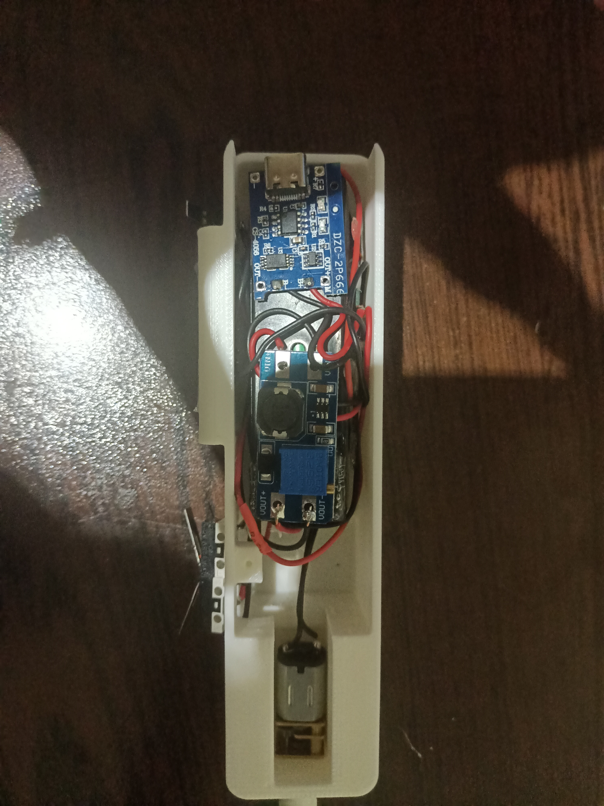

# DIY-Electric-Screwdriver-100RPM-18650-Li-ion-

Merhaba! Bu projede kendi elektrikli tornavidamı nasıl yaptığımı adım adım açıklayacağım.
Oldukça güçlü bir torku var. 100 RPM olduğu için uç kısmı için 3D baskı parçalar
veya mini mandren kullanabilirsiniz.

---

##  Video

---

##  Görseller

| Görsel 1 | Görsel 2 |
|----------|----------|
|  |  |

---

##  Kullanılan Malzemeler

| Adet | Malzeme |
|------|---------|
| 1x | 100RPM 12V Redüktörlü Motor |
| 3x | Limit Switch |
| 1x | 1S 18650 Li-Po Lityum Pil Kapasite Gösterge Modülü |
| 1x | 18650 Pil Yuvası |
| 1x | 18650 Pil |
| 1x | 1S BMS |
| 1x | TP4056 Type-C Şarj Modülü |
| 1x | Ayarlanabilir Voltaj Yükseltici Kart |
| —  | 3D Baskı Parçaları |

---

##  Bağlantılar

Bağlantı şeması ve detaylar için repodaki fotoğraflara göz atabilirsiniz.

---

##  3D Baskı Dosyaları

Tüm 3D baskı dosyaları `/STL` klasöründe mevcuttur.

---

##  Lisans

Bu proje açık kaynaklıdır. Dilediğiniz gibi kullanabilir ve geliştirebilirsiniz.
